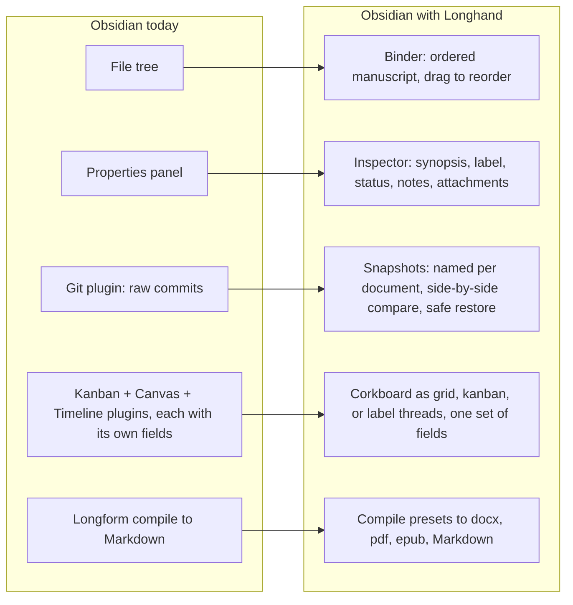
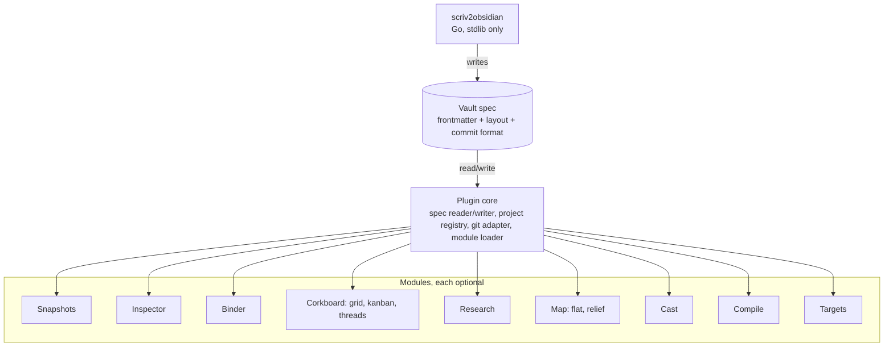

# Longhand

**The writing studio for Obsidian.** Binder, snapshots with live compare, inspector, corkboard, timeline, research, compile. One plugin, one settings page, every module switchable, and everything stored as Markdown, frontmatter, and git commits you can read with nothing installed.

> Status: design phase. The [importer](https://github.com/grassclaw/scrivener-to-obsidian) is under active development; the plugin follows. Watch the repo or open a discussion if you write long-form in Obsidian and want in early.

## What changes when you install it

Uninstall it and every one of those is still there in plain form: the order is in the file names, the metadata is in frontmatter, the snapshots are plain copies in a folder or ordinary git commits, your choice.

Longhand does not sync. iCloud, Dropbox, Obsidian Sync, Syncthing, or a git remote all keep working, and snapshot history travels with the vault to every device. Details in [Sync and history](docs/sync-and-history.md).

## A writing day

- **Before a risky edit**, run *Take snapshot* and name it. One git commit, one file, no terminal.
- **When the edit goes wrong**, open the Snapshots tab. Only this scene's named snapshots are listed. Compare shows the old version on the left and the live text on the right, changes tinted at word level, with a paragraph / sentence / word toggle. Copy a paragraph back, or restore, which snapshots the current state first.
- **When planning**, flip the panel to corkboard and arrange by label: one thread per character or plot line, the chapter's scenes down the axis in manuscript order. Drag a card up to move the scene earlier in the book, sideways to change its label. Switch the axis to story date and the same threads become a timeline.
- **When researching**, the research pane shows the PDFs, images, and notes attached to the scene. Highlight a PDF in Obsidian's viewer and the highlight links back.
- **When submitting**, run compile, pick a manuscript preset, get a docx. The Markdown is untouched.
- **With an AI**, point Claude Code or any agent at the folder. It sees plain Markdown and real git history and can answer "what changed in chapter four since June."

## How it is built

Four rules hold the whole thing together:

1. **Files are the product.** No database, no cache of record, no binary format. Removing the plugin loses UI, never data.
2. **The spec is the contract.** A short, versioned, human-readable document. The importer writes it, the plugin reads it, any future tool can do the same. Unknown fields are preserved, never deleted.
3. **Modular by design.** The core never imports a module. Modules share data only through the spec, so switching one off strands nothing.
4. **Secure by design.** No network calls, no telemetry, git invoked as an argument list never a shell string, no private Obsidian APIs.

## Modules

| Module | What it gives you | Reads | Writes |
|---|---|---|---|
| Snapshots | Named checkpoints per document, compare, restore | git history | git commits |
| Inspector | Synopsis, label, status, notes, keywords, bookmarks beside the text | frontmatter | frontmatter |
| Binder | Ordered manuscript tree, drag to reorder, folder notes as chapters | folder tree, `order` | file names or `order` |
| Corkboard | Cards from synopses as a grid, as kanban columns by status, or as label threads in manuscript order (Scrivener's arrange-by-label); the threads axis can switch to story date | `synopsis`, `label`, `status`, `date` | `order`, `label`, `status`, `date` |
| Research | PDFs, images, notes attached to the current document | attachments, annotations | `attachments` |
| Map | Any image as a map, flat or in relief on desktop, pins linking places to scenes | `type: map`, `image`, `relief`, `pins` | `pins` |
| Cast | Characters and settings as notes; appearances computed from links and approved name matches, shown across the manuscript | `type: character`, `aliases`, links | nothing |
| Compile | Manuscript presets to docx, pdf, epub, Markdown | manuscript order, preset | files outside the vault |
| Targets | Session and project goals, writing history | word counts, git history | `targets` on the project note |

## Repositories

- **[longhand](https://github.com/grassclaw/longhand)**, this repo: the spec, the design, and the plugin.
- **[scrivener-to-obsidian](https://github.com/grassclaw/scrivener-to-obsidian)**: the importer that turns a `.scriv` package into a spec-compliant vault and replays every Scrivener snapshot as git history.

## Read more

- [User stories](docs/user-stories.md): who this is for and a day in their writing life.
- [Architecture](docs/architecture.md): core, modules, compatibility promises, threat model.
- [Vault spec](docs/spec.md): the frontmatter fields, layout, snapshot files, and commit format everything agrees on.
- [Sync and history](docs/sync-and-history.md): how it behaves under iCloud, Dropbox, Obsidian Sync, Syncthing, and git.
- Site: https://grassclaw.github.io/longhand-site/ (source in [longhand-site](https://github.com/grassclaw/longhand-site), with the brand kit)

## License and affiliation

Longhand is an independent project. It is not affiliated with or endorsed by Literature & Latte, the makers of Scrivener, or by Obsidian; those names are trademarks of their respective owners.

MIT. The spec, importer, plugin core, and Snapshots module are and will stay open. Convenience modules may carry a licence later; nothing that guards your data ever will.
